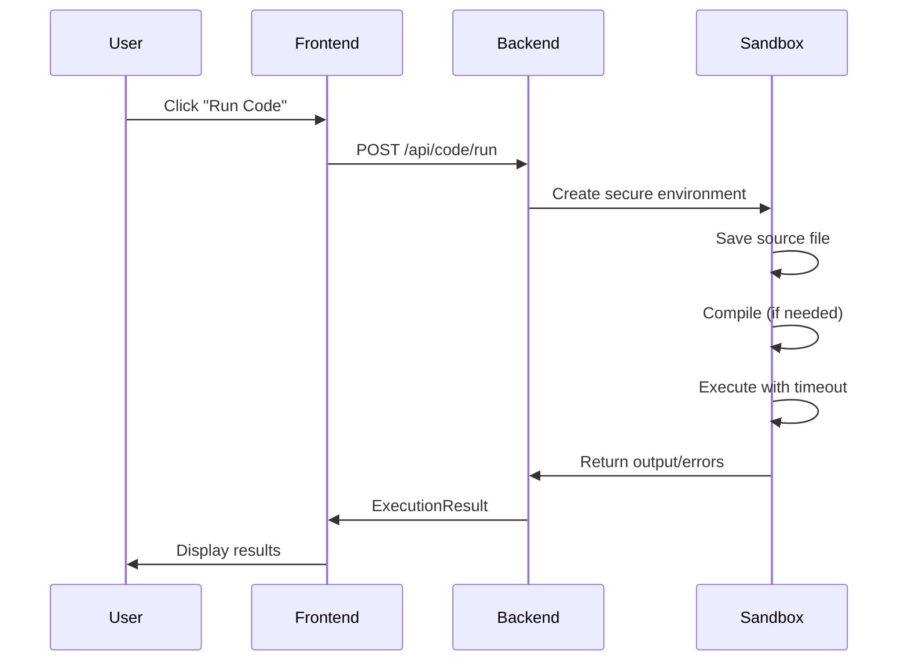
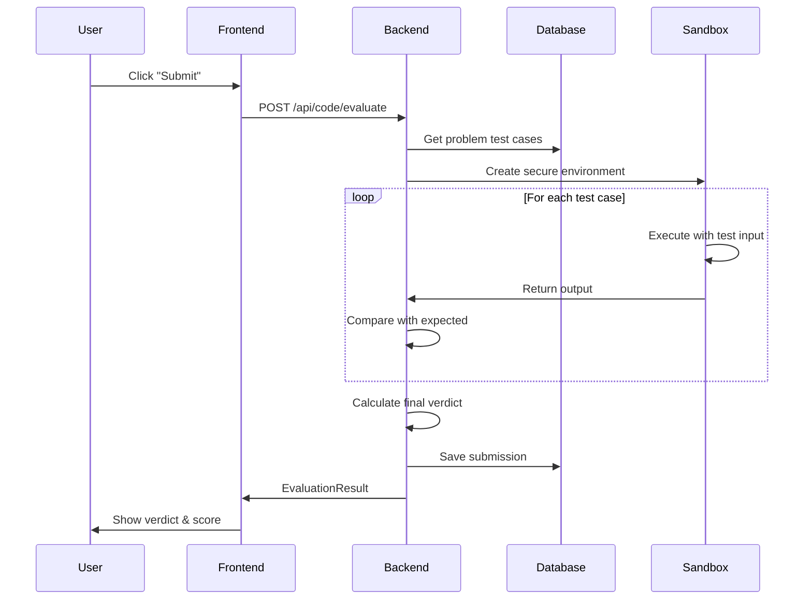

# 🚀 AlgoViz Code Execution & Evaluation Pipeline

## 📋 **Complete System Overview**

This document describes the comprehensive code execution and evaluation pipeline for the AlgoViz Code Editor, featuring real-time compilation, secure sandboxing, and precise test case validation for DSA + DAA problems.

---

## 🏗️ **System Architecture**

### **Frontend (Angular + Monaco Editor)**
```
┌─────────────────────────────────────────────────────────────┐
│                    Angular Frontend                          │
├─────────────────────────────────────────────────────────────┤
│  Monaco Editor Integration                                   │
│  ├── Language Support: C++, Java, Python                   │
│  ├── Syntax Highlighting & Auto-completion                  │
│  ├── Real-time Error Detection                             │
│  └── Theme Support (Dark/Light)                            │
├─────────────────────────────────────────────────────────────┤
│  User Interface                                             │
│  ├── Problem Statement Panel                               │
│  ├── Code Editor Panel                                     │
│  ├── Output/Results Panel                                  │
│  └── Progress Tracking                                     │
├─────────────────────────────────────────────────────────────┤
│  API Integration Layer                                      │
│  ├── CodeExecutionApiService                               │
│  ├── HTTP Client with Timeout Handling                     │
│  ├── Error Handling & User Feedback                        │
│  └── Real-time Status Updates                              │
└─────────────────────────────────────────────────────────────┘
```

### **Backend (Spring Boot)**
```
┌─────────────────────────────────────────────────────────────┐
│                   Spring Boot Backend                        │
├─────────────────────────────────────────────────────────────┤
│  REST API Endpoints                                         │
│  ├── POST /api/code/run        → Execute code              │
│  ├── POST /api/code/evaluate   → Validate submission       │
│  ├── GET  /api/code/problems   → Get problem data          │
│  └── GET  /api/code/submissions → Get submission history   │
├─────────────────────────────────────────────────────────────┤
│  Code Execution Engine                                      │
│  ├── Secure Sandbox Environment                            │
│  ├── Multi-language Compilation (javac, g++, python3)      │
│  ├── Process Management & Timeout Control                  │
│  ├── Resource Limiting (Memory, CPU, File I/O)             │
│  └── Output Capture & Error Handling                       │
├─────────────────────────────────────────────────────────────┤
│  Evaluation System                                          │
│  ├── Test Case Execution                                   │
│  ├── Output Comparison (Normalized)                        │
│  ├── Verdict Determination                                 │
│  ├── Score Calculation                                     │
│  └── Performance Metrics                                   │
├─────────────────────────────────────────────────────────────┤
│  Security Layer                                            │
│  ├── Temporary File Management                             │
│  ├── Process Isolation                                     │
│  ├── Resource Monitoring                                   │
│  └── Cleanup Mechanisms                                    │
└─────────────────────────────────────────────────────────────┘
```

### **Database (MySQL)**
```
┌─────────────────────────────────────────────────────────────┐
│                     MySQL Database                          │
├─────────────────────────────────────────────────────────────┤
│  Core Tables                                               │
│  ├── problems        → Problem definitions                 │
│  ├── test_cases      → Input/output test data             │
│  ├── starter_codes   → Language-specific templates        │
│  └── submissions     → User submission history            │
├─────────────────────────────────────────────────────────────┤
│  Indexes & Performance                                     │
│  ├── User-Problem lookup optimization                     │
│  ├── Submission history queries                           │
│  ├── Problem filtering by difficulty/category             │
│  └── Performance analytics                                │
└─────────────────────────────────────────────────────────────┘
```

---

## 🔧 **Technical Implementation**

### **1. Code Execution Flow**

#### **Run Code (Testing)**


#### **Submit Code (Evaluation)**


### **2. Security & Sandboxing**

#### **Process Isolation**
```java
// Secure execution environment
ProcessBuilder pb = new ProcessBuilder();
pb.directory(workingDir.toFile());

// Resource limits
pb.environment().put("MALLOC_ARENA_MAX", "1");
pb.command("java", "-Xmx128m", "-cp", ".", "Main");

// Timeout control
boolean finished = process.waitFor(5000, TimeUnit.MILLISECONDS);
if (!finished) {
    process.destroyForcibly();
}
```

#### **File System Security**
```java
// Temporary isolated directories
Path workingDir = Paths.get("/tmp/algoviz/session_" + sessionId);
Files.createDirectory(workingDir);

// Restrictive permissions
Runtime.getRuntime().exec("chmod 700 " + workingDir.toString());

// Automatic cleanup
Files.walk(workingDir)
    .sorted(Comparator.reverseOrder())
    .map(Path::toFile)
    .forEach(File::delete);
```

### **3. Evaluation Logic**

#### **Verdict Determination**
```java
public enum Verdict {
    ACCEPTED,                    // ✅ All test cases passed
    WRONG_ANSWER,               // ❌ Output mismatch
    TIME_LIMIT_EXCEEDED,        // ⏰ Execution timeout
    MEMORY_LIMIT_EXCEEDED,      // 💾 Memory overflow
    RUNTIME_ERROR,              // 💥 Crash/exception
    COMPILATION_ERROR,          // 🔧 Compile failure
    PRESENTATION_ERROR,         // 📝 Format issues
    INTERNAL_ERROR             // ⚠️ System error
}
```

#### **Score Calculation**
```java
private int calculateScore(int passedTests, int totalTests, int maxScore) {
    if (totalTests == 0) return 0;
    
    // Base score from test case success rate
    double baseScore = (double) passedTests / totalTests * maxScore;
    
    // Additional factors can be added:
    // - Code efficiency bonus
    // - Time complexity analysis
    // - Memory usage optimization
    
    return (int) Math.round(baseScore);
}
```

### **4. Output Comparison**

#### **Normalized Comparison**
```java
private boolean compareOutputs(String expected, String actual) {
    if (expected == null || actual == null) {
        return expected == actual;
    }
    
    // Normalize whitespace and compare
    String normalizedExpected = expected.trim().replaceAll("\\s+", " ");
    String normalizedActual = actual.trim().replaceAll("\\s+", " ");
    
    return normalizedExpected.equals(normalizedActual);
}
```

---

## 📊 **Database Schema**

### **Problems Table**
```sql
CREATE TABLE problems (
    id BIGINT AUTO_INCREMENT PRIMARY KEY,
    title VARCHAR(255) NOT NULL,
    description TEXT,
    scenario TEXT,
    input_format TEXT,
    output_format TEXT,
    hints TEXT,
    difficulty ENUM('EASY', 'MEDIUM', 'HARD') NOT NULL,
    category VARCHAR(100),
    time_limit INT DEFAULT 2000,     -- milliseconds
    memory_limit INT DEFAULT 128,    -- MB
    max_score INT DEFAULT 100,
    xp_reward INT DEFAULT 50,
    created_at TIMESTAMP DEFAULT CURRENT_TIMESTAMP
);
```

### **Test Cases Table**
```sql
CREATE TABLE test_cases (
    id BIGINT AUTO_INCREMENT PRIMARY KEY,
    problem_id BIGINT NOT NULL,
    test_number INT NOT NULL,
    input TEXT,
    expected_output TEXT,
    is_sample BOOLEAN DEFAULT FALSE,
    explanation VARCHAR(500),
    time_limit INT,                  -- Override if needed
    memory_limit INT,                -- Override if needed
    FOREIGN KEY (problem_id) REFERENCES problems(id)
);
```

### **Submissions Table**
```sql
CREATE TABLE submissions (
    id BIGINT AUTO_INCREMENT PRIMARY KEY,
    user_id BIGINT NOT NULL,
    problem_id BIGINT NOT NULL,
    language VARCHAR(20) NOT NULL,
    code TEXT NOT NULL,
    verdict ENUM('ACCEPTED', 'WRONG_ANSWER', 'TIME_LIMIT_EXCEEDED', 
                 'MEMORY_LIMIT_EXCEEDED', 'RUNTIME_ERROR', 
                 'COMPILATION_ERROR', 'PRESENTATION_ERROR', 
                 'INTERNAL_ERROR') NOT NULL,
    score INT DEFAULT 0,
    execution_time BIGINT,           -- milliseconds
    memory_used BIGINT,              -- bytes
    passed_tests INT DEFAULT 0,
    total_tests INT DEFAULT 0,
    error TEXT,
    submitted_at TIMESTAMP DEFAULT CURRENT_TIMESTAMP
);
```

---

## 🎯 **API Endpoints**

### **Code Execution**
```http
POST /api/code/run
Content-Type: application/json

{
  "code": "public class Main { ... }",
  "language": "JAVA",
  "input": "5 10 15"
}

Response:
{
  "success": true,
  "output": "30",
  "executionTime": 245,
  "memoryUsed": 1024000,
  "exitCode": 0
}
```

### **Code Evaluation**
```http
POST /api/code/evaluate
Content-Type: application/json

{
  "code": "public class Main { ... }",
  "language": "JAVA",
  "problemId": 1,
  "userId": 123
}

Response:
{
  "verdict": "ACCEPTED",
  "score": 100,
  "message": "All test cases passed!",
  "testResults": [
    {
      "testCaseNumber": 1,
      "input": "85 78 92 95",
      "expectedOutput": "Final Grade: 86.5, Letter: B+",
      "actualOutput": "Final Grade: 86.5, Letter: B+",
      "passed": true,
      "executionTime": 156,
      "verdict": "ACCEPTED"
    }
  ],
  "executionTime": 456,
  "totalTestCases": 5,
  "passedTestCases": 5
}
```

---

## 🔒 **Security Features**

### **Sandbox Environment**
- **Process Isolation**: Each execution runs in isolated process
- **Resource Limits**: Memory (128MB), Time (5s), File size (1MB)
- **Temporary Files**: Automatic cleanup after execution
- **Permission Control**: Restricted file system access

### **Input Validation**
- **Code Size Limits**: Maximum 64KB source code
- **Language Validation**: Only supported languages allowed
- **SQL Injection Prevention**: Parameterized queries
- **XSS Protection**: Input sanitization

### **Rate Limiting**
- **Submission Limits**: Max 10 submissions per minute per user
- **Concurrent Executions**: Limited to 10 simultaneous processes
- **Resource Monitoring**: CPU and memory usage tracking

---

## 📈 **Performance Optimizations**

### **Caching Strategy**
- **Problem Data**: Cache frequently accessed problems
- **Compilation Results**: Cache compiled binaries for identical code
- **Test Case Results**: Cache results for duplicate submissions

### **Database Optimization**
- **Indexes**: Optimized for user-problem queries
- **Connection Pooling**: Efficient database connections
- **Query Optimization**: Minimized N+1 queries

### **Execution Optimization**
- **Process Reuse**: Reuse JVM instances where possible
- **Parallel Testing**: Run independent test cases concurrently
- **Early Termination**: Stop on first failure for efficiency

---

## 🚀 **Deployment & Scaling**

### **Docker Configuration**
```dockerfile
# Backend service
FROM openjdk:17-jdk-slim
RUN apt-get update && apt-get install -y gcc g++ python3
COPY target/algoviz-backend.jar app.jar
EXPOSE 9191
CMD ["java", "-jar", "app.jar"]
```

### **Kubernetes Scaling**
```yaml
apiVersion: apps/v1
kind: Deployment
metadata:
  name: algoviz-backend
spec:
  replicas: 3
  selector:
    matchLabels:
      app: algoviz-backend
  template:
    spec:
      containers:
      - name: backend
        image: algoviz/backend:latest
        resources:
          limits:
            memory: "2Gi"
            cpu: "1000m"
          requests:
            memory: "1Gi"
            cpu: "500m"
```

---

## 📊 **Monitoring & Analytics**

### **Metrics Tracked**
- **Execution Times**: Average, P95, P99 response times
- **Success Rates**: Compilation and execution success rates
- **Resource Usage**: CPU, memory, disk usage patterns
- **User Behavior**: Submission patterns, problem difficulty analysis

### **Logging Strategy**
```java
// Structured logging for monitoring
logger.info("Code execution completed", 
    Map.of(
        "userId", userId,
        "problemId", problemId,
        "language", language,
        "verdict", verdict.name(),
        "executionTime", executionTime,
        "memoryUsed", memoryUsed
    ));
```

---

## 🎓 **Educational Features**

### **Progressive Difficulty**
- **Easy**: Basic syntax and logic problems
- **Medium**: Algorithm implementation challenges  
- **Hard**: Complex optimization and advanced data structures

### **Learning Support**
- **Starter Code**: Language-specific templates
- **Hints System**: Progressive hint revelation
- **Detailed Feedback**: Specific error explanations
- **Performance Analysis**: Time/space complexity insights

### **Gamification**
- **XP System**: Points for successful submissions
- **Badges**: Achievement unlocks for milestones
- **Leaderboards**: Competitive programming rankings
- **Streak Tracking**: Consecutive success monitoring

---

## 🔧 **Configuration**

### **Application Properties**
```yaml
# Code execution settings
code:
  execution:
    timeout: 5000                    # 5 seconds max execution
    memory-limit: 128               # 128MB memory limit
    temp-dir: /tmp/algoviz         # Temporary file directory
    max-concurrent-executions: 10   # Concurrent process limit
    cleanup-interval: 300000        # 5 minutes cleanup interval

# Security settings
security:
  sandbox:
    enabled: true
    resource-limits:
      max-file-size: 1048576        # 1MB max file size
      max-output-size: 1048576      # 1MB max output
      max-processes: 5              # Max child processes
```

---

## 🎉 **System Benefits**

### **For Students**
- **Real-time Feedback**: Immediate compilation and execution results
- **Professional Environment**: Industry-standard Monaco Editor
- **Comprehensive Testing**: Multiple test cases with detailed feedback
- **Progress Tracking**: XP, badges, and achievement systems

### **For Educators**
- **Automated Grading**: Precise evaluation with detailed reports
- **Problem Management**: Easy problem creation and modification
- **Analytics Dashboard**: Student performance insights
- **Scalable Architecture**: Handles multiple concurrent users

### **For Administrators**
- **Security**: Sandboxed execution environment
- **Monitoring**: Comprehensive logging and metrics
- **Scalability**: Horizontal scaling capabilities
- **Maintenance**: Automated cleanup and resource management

---

This complete code execution and evaluation pipeline provides a production-ready, secure, and scalable solution for online coding education and assessment. The system handles everything from basic syntax checking to complex algorithm evaluation, making it perfect for DSA and DAA learning platforms.
